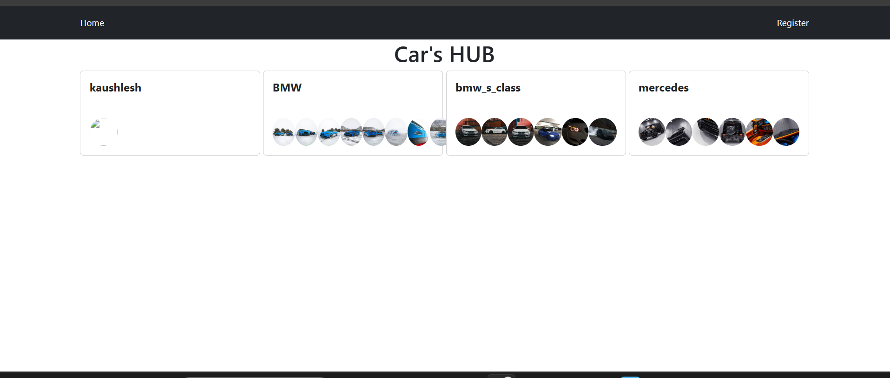
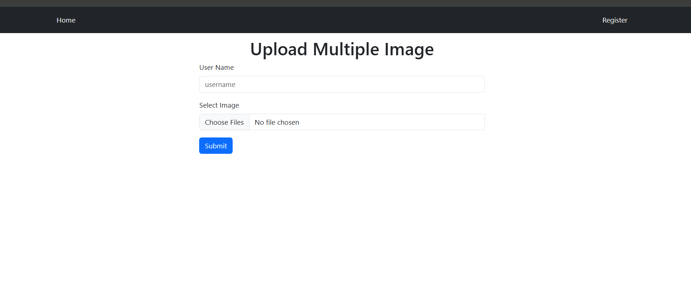

# Car Hub Portal - Frontend

This is the frontend for the Cars Hub Portal, a web application where users can log in, upload car photos, and view or delete their photos.

## Features
- User login and authentication
- Upload and view car photos
- Delete car photos
- Responsive design for a smooth user experience

## Technologies Used
- React
- Axios (for API requests)
- HTML, CSS, JavaScript
- Material-UI (for UI components)


# Project Name

## Images

### Homepage


### Register


### Uploading Interface


### Folder Structure 

```

Car_frontend/
├── images/
├── src/
│   ├── components/
│   │   └── header.js
│   └── pages/
│       ├── home.js
│       ├── register.js
│       └── operation.js
├── app.js
├── app.test.js
├── index.js
└── reportWebVitals.js
```


## Setup

### Prerequisites:
- Node.js installed
- A backend server running (instructions available in the [Backend README](./Backend_README.md))

### Install Dependencies:
1. Clone the repository:
   ```bash
   git clone https://github.com/yourusername/Car_frontend.git
   cd Car_frontend
   ```
2. Install Dependencies 
```bash
   npm install
```
3.Run the development server
```bash
   npm start
```

4. Access the Application
```bash
   http://localhost:3000
```


### Explanation:

This `README.md` contains all the necessary instructions for someone to run the repository locally:

1. **Cloning the repository**: The user will clone the repository and navigate into the project folder.
2. **Installing dependencies**: They will install all the required dependencies using `npm install`.
3. **Running the development server**: Instructions to run the app locally using `npm start`.
4. **Accessing the app**: The user can open the browser and go to `http://localhost:3000` to view the application.

This is the standard format for providing setup instructions in a `README.md` file for a Node.js/React project.

Let me know if you'd like to add anything else to it!

     
